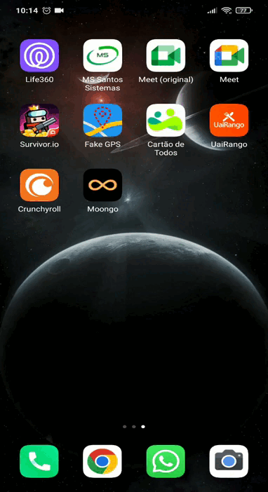
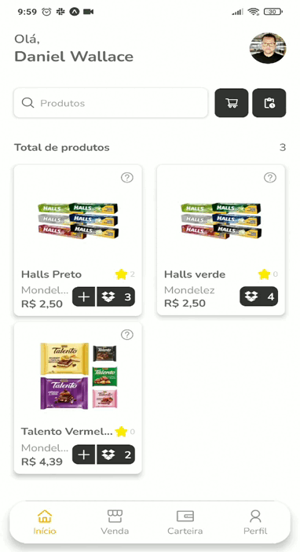

<p align="center">
  
  
  <a href="https://github.com/danielwsilva/moongo/commits/master">
    
  </a>
  
  

  <a href="https://github.com/danielwsilva">
    
  </a>
</p>

<p align="center">
  
  
</p>

## 💻 Sobre o projeto

Apresentamos nossa inovadora Wallet para motoristas. Compras de produtos para o carro são simples: o saldo cresce com as vendas e pode ser usado para novas compras ou resgates. Simplifique a gestão de produtos no carro com praticidade e controle.

## 🧭 Rodando a aplicação (API FORA DO AR)

```bash

# Clone este repositório
$ git clone https://github.com/danielwsilva/moongo.git

# Acesse a pasta do projeto no seu terminal/cmd
$ cd moongo

# Instale as dependências
$ yarn

# Execute a aplicação
$ yarn start

```

## 🛠 Tecnologias

As técnologias envolvidas na construção do projeto:

#### React Native

- **expo**
- **react-navigation**
- **axios**
- **react-query**
- **expo-google-fonts**
- **react hooks**
- **react-native-mask-input**
- **formik**
- **yup**
- **styled-components**
- **moti**
- **lottie**
- **context**
- **flash-list**


## 🦸‍♂️ **Autor**

<p>
<kbd>
 
 </kbd>
 <br />
 <sub><strong>🌟 Daniel Wallace 🌟</strong></sub>
</p>

[](https://www.linkedin.com/in/daniel-wallace-1b9280b2/)
[](mailto:danielwllacec@gmail.com)

---

## 📝 Licença

Este projeto esta sobe a licença [MIT](./LICENSE).

Feito com :satisfied: por Daniel Wallace 👋🏽 [Entre em contato!](https://www.linkedin.com/in/daniel-wallace-1b9280b2/)

---
